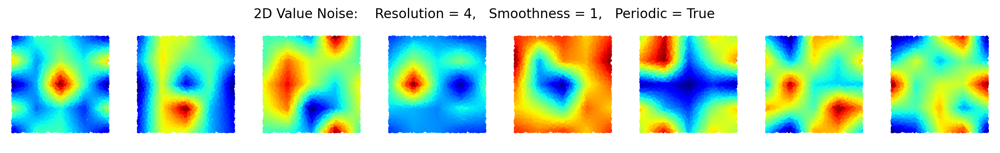

# Noise Generation in PyTorch
PyTorch modules for sampling from Perlin Noise (or Value Noise)
- N-dimensional noise, not just 2D or 3D
- Several noise fields can be sampled in parallel
- Modules are differentiable
- Resolution, smoothness, and periodicity of noise can be configured

## Examples
The following examples each visualize 8 noise fields sampled for 10000 random points.



Here is a snippet of code demonstrating how the model is created and used:
```python
import torch
from noise import *

### Create Perlin Noise Module ###
n_dims     =  3
res        =  4
n_fields   = 24
periodic   = True
smoothness =  2
model = PerlinNoise(n_dims=n_dims, n_fields=n_fields, res=res, periodic=periodic, smoothness=smoothness)

### Sample noise at 10000 random points ###
n_points = 10000
input_points = torch.rand(n_points, n_dims)
noise_fields = model(input_points)
```

## Requirements
- PyTorch
- Python 3.11 or higher (required to allow list unpacking inside an index)